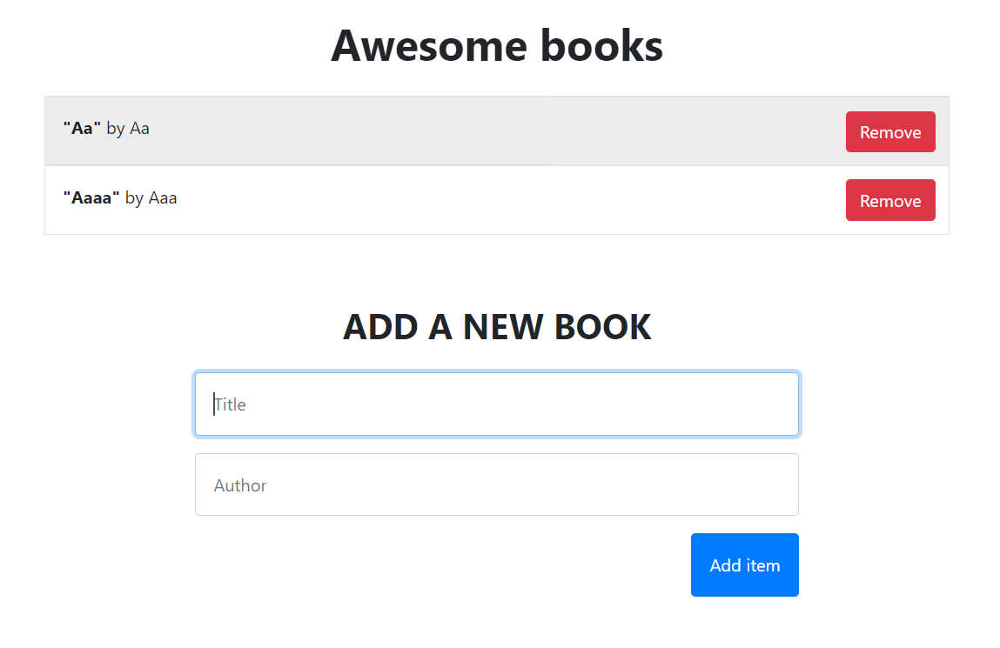

# Awesome Books. Dynamic websites with JS

Tasks to do:

- Project 1: Manage books collection (plain JS with objects).
- Project 2: Manage books collection (plain JS with classes).
- Project 3: Style core elements of the page.
- Project 4: Create a complete website with navigation.

## Built With

- HTML
- CSS
- JS

## Authors

👤 **Teddy Ememandu**

- GitHub: [@TedLivist](https://github.com/TedLivist)

👤 **Elmar Abdulkarimov**

- GitHub: [@elmar8287](https://github.com/elmar8287)

## Live demo
You can visit live version via [link](https://tedlivist.github.io/awesome-books/)

## 🤝 Contributing

Contributions, issues, and feature requests are welcome!

Feel free to check the [issues page](../../issues/).

## Show your support

Give a ⭐️ if you like this project!

## Acknowledgments

But, the project personalized for my  purposes.

## 📝 License

This project is [MIT](./MIT.md) licensed.
